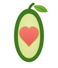

  

<h1 align="center">guacluv</h1>

<strong>Avocados, with love.</strong> Ripe on the day you want to eat them.

  🌐 <a href="https://victordelrosal.com/guacluv"><strong>victordelrosal.com/guacluv</strong></a>

---

guacluv is a concept venture — a **ripeness-as-a-service** avocado brand. Pick your eat-day, we ripen to the hour, it's delivered ready. Or the next one's on us.

This folder is the whole thing, end to end:

| File | What it is |
|------|-----------|
| [`index.html`](./index.html) | The storefront / brand landing page (responsive, light + dark, interactive ripeness demo, waitlist capture) |
| [`BUSINESS.md`](./BUSINESS.md) | Business architecture — problem, product line, unit economics, GTM, moats, roadmap |
| [`BRAND.md`](./BRAND.md) | Brand system — logo, palette, type, voice, UI motifs |
| [`assets/logo.svg`](./assets/logo.svg) | Primary avocado-heart logo |
| [`og.svg`](./og.svg) | Social share card |

### Product line
- **The Daily Half** — weekly ripe-day avocado subscription (from €14/wk)
- **Guac Night Kit** — everything for fresh guac (€19)
- **Single-Origin Box** — seasonal varieties with tasting notes (from €22)
- **guacluv Club** — perks, priority ripening, weekly recipes (€9/mo)

### Tech
Zero-dependency static site. Self-contained HTML/CSS/JS, Google Fonts, inline SVG art. Served via GitHub Pages under the `victordelrosal.com` custom domain. The waitlist form stores locally and opens a pre-filled email so signups reach a human without a backend — swap in Formspree/a real endpoint to go fully live.

---

Grown with 💚 by <a href="https://victordelrosal.com">Victor del Rosal</a> · A concept venture.

